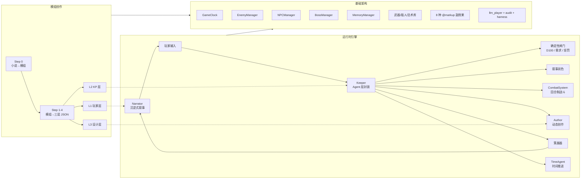

# TRPG 调查员助手

基于 LLM 的 TRPG（桌上角色扮演游戏）KP 助手，COC 7th 规则。从玩家输入到沉浸式叙事生成的完整调用链。

> **编码**：本项目 ~98% 的代码由 Claude Code / Open Code + DeepSeek / Kimi 自动生成,DeepSeek V4 Pro贡献了90%以上的代码，Kimi用于前端审美辅助，此外Gemini没有参与代码编写但是用于辅助设计。作者主要负责需求分析、架构设计、提示词微调、Skills和其他Coding Agents的方法论管理、测试验证与方向把控。

## 系统综述

TRPG 调查员助手是一个**模块化、多层 LLM 协作的跑团游戏引擎**。它不只是一个"AI KP"——它是一套完整的模组创作→游戏运行→测试审计工具链。

**核心思路**：将 TRPG 游戏分解为可独立演进的子系统——战斗、NPC、时间、检定、叙事、模组创作——每个子系统通过 dataclass 消息合约通信，可单独替换或增强。LLM 负责叙事与意图判定，确定性规则负责数值检定与状态管理。离线管线将模组文档编译为三层 JSON，运行时引擎消费 JSON 驱动游戏。



**关键特性**：

| 维度 | 说明 |
|------|------|
| 架构 | 4-Agent 协作（Keeper/Narrator/Author/TimeAgent）+ IntentDetector + PreParseDisambiguator，14 个独立子系统 |
| 管线 | 小说→模组→三层 JSON，13 次 LLM 调用，全自动渐进式解析 |
| 战斗 | 独立回合制引擎，纯 Python/D100/公式，Boss 与普通战斗分流 |
| NPC | LLM 对话 + 5 级态度状态机 + 跟随系统 + 记忆上下文注入 |
| 检定 | COC 7th D100 + trait enhancement + 失败递增惩罚（难度→LLM 创意） |
| 时间 | 确定性分钟计时器 + LLM 时间评估 + entity 时间约束 |
| 扩展 | @markup 副效果系统（8 种），Author 运行时动态创作 |
| 前端 | FastAPI + HTMX + 预编译 Tailwind CSS + 素材背景轮播系统，视觉小说风格沉浸布局 |
| 测试 | 18 case 并行 harness + LLM 模拟玩家 + 日志双层审计 |
| 数据 | 三层信息架构（玩家/KP/设计者），JSON 全量序列化 |

---

# 玩家版 · 游戏指南

## 这是什么

一个由 LLM 担任 KP（守秘人）的文字跑团游戏。你创建调查员、探索场景、与 NPC 交互、战斗、发现线索，所有叙事由 AI 实时生成。

## 安装与启动

```bash
pip install openai python-docx PyPDF2 ipython fastapi uvicorn jinja2 websockets
# 在项目根目录创建 .env: DEEPSEEK_API_KEY=your-key
```

```bash
uvicorn frontend.server:app --reload    # 开发模式 → localhost:8080
python run_game.py                      # 生产模式（自动打开浏览器）
```

## 前端页面

| 路由 | 页面 | 做什么 |
|------|------|--------|
| `/` | 启动页 | 4 个 Tab：模组生成管线 → 小说转模组 (Step 0) → 开始游戏 → 全局设置 |
| `/character` | 车卡创建 | 3 步向导：基本信息+属性掷骰 → 职业+技能分配 → 预览导出 .zip |
| `/game` | 游戏循环 | 视觉小说风格沉浸布局，双面板（叙事+角色卡），展开式会话面板 |
| `/editor` | JSON 编辑器 | 三栏布局：文件树 → JSON 可折叠树 → 校验状态，支持保存和验证 |

## 游戏内功能

- **探索**：输入行动描述，系统匹配场景互动物/通行路径
- **检定**：执行 D100 技能检定（45 项 COC 7th 标准技能），成功/失败影响叙事
- **战斗**：回合制战斗系统，动作选项：攻击/闪避/逃跑/施法（未来）
- **NPC 对话**：与场景内 NPC 自由交谈，态度和记忆影响回复
- **搜索**：检定成功发现隐藏物品/线索/武器
- **存档**：`/save <槽位>` 保存，`/load <槽位>` 读取，支持调查员长期存档

### 输出格式 — PlayerFacingSnapshot

每回合输出统一使用 `PlayerFacingSnapshot`（`src/game/messages.py`），包含以下章节：

| 章节 | 来源 | 内容 |
|------|------|------|
| `## 叙事` | Narrator | 沉浸式叙事文本（核心输出） |
| `## 场景` | L1 层 | 场景名 + 沉浸式第三人称描写 + 出口方向 |
| `## 角色` | L1 层 | 在场 NPC 的外貌与神态 |
| `## 时间` | GameClock | 第N天，时段 HH:MM |
| `## 技能` | Judge | 检定实体 ID、成功/失败、COC 等级、D100 骰值、trait 增强 |
| `## 战斗` | CombatSystem | 胜负结果 + 叙事摘要 |

- **CLI** (`run_game.py`)：输出为半结构化 Markdown，每个 `##` 章节下为自然语言正文
- **前端** (`game.html`)：PlayerFacingSnapshot 分为两部分展示：
  - **动态信息**（叙事区）：每回合的 Narrator 叙事 + Brief + 技能检定标签 + 战斗结果卡片，按 `.turn-card` 逐回合堆叠
  - **静态信息**（场景信息卡，左上角可展开面板）：场景名/描述/时间/出口列表/NPC 列表，每回合自动同步更新
- **角色卡**（右侧面板）：收起态显示头像+HP/SAN 进度条；展开态分层展示属性网格/状态条/分类折叠技能/武器/物品

## 调试命令

| 命令 | 作用 |
|------|------|
| `/scene` | 查看当前场景完整信息 |
| `/char` | 查看调查员角色卡（属性/技能/武器/物品） |
| `/flags` | 查看已完成实体和运行时状态 |
| `/events` | 查看已触发事件 |
| `/help` | 帮助 |
| `/spawn enemy <名称>` | 从敌人库生成敌人 |
| `/spawn weapon <名称>` | 从武器库分发武器 |

---

# KP 版 · 模组配置与运行

## 模组生成管线

### 完整流程

```
纯小说/叙事文本
  │ python run_step0.py <小说路径>         ← Step 0: 小说→模组格式（1 次 LLM，pro/max）
  ▼ data/modules/<名称>/module_step0.txt
  │ python run_pipeline.py --auto ...       ← Step 1-4: 模组文本→三层 JSON（12 次 LLM）
  ▼ data/modules/<名称>/l1/l2/l3.json
  │ 浏览器 localhost:8080                   ← 启动游戏
  ▼ 玩家体验
```

### Step 0 — 叙事转模组

将纯小说/叙事文本改写为结构化模组文档。输出可直接进入管线 Step 1a。

```bash
python run_step0.py "我的小说.txt"                           # 自动输出到 data/modules/
python run_step0.py "小说.txt" "data/modules/模组名/out.txt"  # 指定输出路径
```

LLM 做两阶段处理：先以原作者视角理解剧情脉络/世界观/驱动力 → 再以模组设计师身份改写为场景+线索+NPC+敌人+多结局。输出含 9 个标准章节（module_overview / scenes / npcs / enemies / clues_and_items / events_summary / endings / locations_and_map）。

#### 测试小说

| 小说 | 文件 | 字数 | 状态 |
|------|------|------|------|
| 《深渊第七城》 | `深渊第七城.md` | ~5.1万字 | 待测试 — 1927年南太平洋远征·铸星者遗迹·考古惊悚 |

**用法**：将测试小说喂入 Step 0 → 管线全自动解析 13 次 LLM 调用 → 输出三层 JSON → 启动跑局测试。

### Step 1-4 — 模组→三层 JSON

将结构化模组文档（docx 或 Step 0 输出）解析为三层 JSON：

```bash
python run_pipeline.py                                          # 交互式向导
python run_pipeline.py --auto --docx "常暗之厢.docx" --module 常暗之厢
python run_pipeline.py --config config.json                     # 从配置文件
python run_pipeline.py --config config.json --start-from step_3a # 断点续跑
```

12 次 LLM 调用，7 步渐进式解析：

| 步骤 | 内容 | 并行 |
|------|------|------|
| Step 1a/1b | 结构化提取（meta/scenes/characters/enemies/weapons/boss）+ 精修模组 | 2 并行 |
| Step 2a | Interactions + scene_movements | — |
| Step 2b/2c | Events+AT（合并）∥ L1 玩家层 ∥ L3 设计者层 | 3 并行 |
| Step 2_boss | Boss 遭遇详述（从 Step 1a boss_hints + interactions/AT 派生） | — |
| Step 3a/2.5 | 去重/冲突/结局验证 ∥ NPC 档案+实体归属 | 2 并行 |
| Step 3b | L1↔L2↔L3 交叉核对（确定性优先 + LLM gap-fill） | — |
| Step 3.5 | 依赖图构建 + 循环检测 | — |
| Phase 2 | type 标准化 + side_effects → @markup | — |

每步含 `_with_fallback` 保底策略。Step 3b 确定性优先将 prompt 从 40K token 压缩到 ~2K。

## 启动页可配参数

| 参数 | 说明 |
|------|------|
| API Key | DeepSeek API 密钥（在 `src/config_llm.py` 配置或在界面设置） |
| 模型 | `deepseek-v4-pro`（重推理）/ `deepseek-v4-flash`（轻量） |
| TimeAgent | 时间推进 LLM 评估开关 |
| WR0 | 创作者豁免（Author 不受世界规则约束） |
| Tier 2 Judgment | LLM 增强技能判定开关 |

启动页顶栏含 4 个 Tab：模组生成（Step 1+ 管线）、小说转模组（Step 0 独立步骤）、开始游戏（直接启动）、其他工具（全局设置 + JSON 编辑器入口）。

## @markup 副效果系统（8 种）

| 标记 | 效果 | 应用路径 |
|------|------|----------|
| `@spawn_enemy(enemy_ref="", scene="", quantity=1)` | 生成敌人实例 | EnemyManager.spawn() → combat entry |
| `@grant_weapon(weapon_ref="", scene="", quantity=1)` | 武器放置到场景 | SceneWeapon → search 发现 → 拾取 |
| `@stat_change(stat_name="", delta=-1, narrative="")` | 修改属性 + 更新描述 | Investigator.modify_stat() |
| `@item_gain(item_name="", quantity=1)` | 获得物品 | ItemManager.add() |
| `@consume_item(item_name="", quantity=1)` | 消耗物品 | ItemManager.remove() + LLM 模糊匹配 |
| `@npc_state_change(npc_name="", new_state="")` | NPC 状态变化 | NPCManager.set_state() |
| `@npc_follow(npc_name="", follow=true/false)` | NPC 跟随/离开 | NPCManager.set_following() |
| `@grant_spell(spell_ref="")` | 获得法术（U9 预留） | Investigator.known_spells |

## 时间系统

确定性分钟计时器（`GameClock`），LLM TimeAgent 评估额外耗时。模组 Entity 支持 `time_condition` 字段：

```
time_condition: [{"day": ">=2", "times": ["夜间"]}]  # 第2天起夜间触发
time_condition: []  # 无时间约束
```

## 战斗系统

COC 7th 回合制。Boss 战斗与普通战斗分流：

| 类型 | 失败后果 |
|------|----------|
| 普通战斗 loss | 角色死亡，游戏结束 |
| Boss 战斗 loss | 返回 `combat_boss_loss` 信号，不强制结束 |

## 失败惩罚

多次检定同一实体失败时三层递增：难度提升 → 计数累加 → LLM 创意惩罚（扣 HP/SAN、刷怪、NPC 变敌对等）。

## 公开发行打包

```bash
pyinstaller -F --noconsole --name "TRPG助手" \
  --add-data "frontend/templates;frontend/templates" \
  --add-data "frontend/static;frontend/static" \
  --add-data "data;data" --add-data "src;src" \
  --hidden-import fastapi --hidden-import uvicorn --hidden-import jinja2 --hidden-import openai \
  run_game.py
```

API Key 不打包，启动后 Web 界面配置。`--onedir` 误报率低于 `--onefile`。需在对应系统分别打包。

---

# 开发者版 · 架构与设计

## 设计理念

- **高内聚模块化**：每个子系统（CombatSystem / EnemyManager / NPCManager / Judge / Curator / Clock / SpellJudge）是独立可编辑的模块，通过 dataclass 消息合约通信，可脱离主循环单独测试。战斗不是唯一可编辑的系统——任何子系统都可以替换或增强
- **Agent 层封装**：Keeper 不是传统意义上的单一 Agent，而是一层 Agent 集合的封装——内部持有 Judge（确定性）、Curator（确定性）、IntentDetector（LLM）、PreParseDisambiguator（消歧网关）、CombatSystem（独立引擎），并通过 ThreadPoolExecutor 并行编排 enrich / combat_entry / TimeAgent 三个 LLM 调用。对外只暴露 `process_turn()` 一个入口
- **消歧网关**：Parse 前插入 PreParseDisambiguator（flash 模型），对模糊输入反问引导而非强行匹配。跨 turn 上下文整合（"搜一下"+"抽屉"→"搜查抽屉"），连续 2 次模糊后兜底执行
- **闭世界假设**：玩家可执行动作由模组预设 entity 界定。未匹配 entity 的输入走 search/other/Author 管线
- **确定性+LLM 混合**：硬性条件（requirement/dependency/time_condition）确定性判断，叙事/意图判定 LLM 执行
- **输出管线分离**：`skill_detail`（骰值/标记）走独立管线，不经过 Narrator——"叙事者只叙事"

## 子系统总览

所有子系统均可独立编辑、替换、测试：

| 子系统 | 文件 | 类型 | 职责 | 独立测试 |
|--------|------|------|------|----------|
| GameClock | `game/clock.py` | 纯确定性 | 分钟计时器，day/hour/time_of_day，自动注入 time flags | ✅ |
| Judge | `game/judge.py` | 确定性 + LLM | requirement 检查、D100 检定、失败惩罚、trait enhancement | — |
| Curator | `game/curator.py` | 纯确定性 | outcomes + ambient → NarratorBrief | — |
| CombatSystem | `game/combat.py` | 确定性 + LLM | 回合制战斗引擎，伤害公式/护甲/D100/先攻 | ✅ smoke |
| EnemyManager | `game/enemy_manager.py` | 纯确定性 | 敌人实例追踪、spawn/status/combat 生命周期 | ✅ |
| BossManager | `game/boss_manager.py` | 纯确定性 | Boss 发现（at/event 触发）、CombatInit 构造 | ✅ |
| NPCManager | `game/npc_manager.py` | 确定性 + LLM | NPC 对话/态度状态机/跟随、记忆上下文注入 | ✅ |
| IntentDetector | `game/intent_detector.py` | LLM flash | other 行为判定是否有叙事意图 | ✅ |
| PreParseDisambiguator | `game/pre_parse.py` | LLM flash | Parse 前消歧网关，跨 turn 上下文整合，模糊输入反问引导 | ✅ |
| TurnLogger | `game/turn_logger.py` | 纯 I/O | 每轮 player→enrich→narrator 全程记录 | ✅ |
| SpellJudge | `game/spell_judge.py` | 确定性 + LLM | 法术识别/约束检查/Author 联动（U9 待实现） | — |
| SpellLibrary | `library/spells.py` | 纯数据 | 法术库加载/查询（U9 待实现） | — |
| SideEffects | `game/side_effects.py` | 纯解析 | 8 种 @markup → dataclass 解析器 | ✅ |
| Investigator | `investigator/` | 纯规则 | COC 7th 车卡、D100 检定、物品/武器管理 | ✅ |

## 三层信息架构

| 层 | 拥有者 | 职责 |
|----|--------|------|
| L1 玩家可见层 | Narrator | 场景初始感知信息，面向玩家 |
| L2 KP 守秘人层 | Keeper | 场景/互动/事件/AT/NPC/敌人/Boss 完整数据 |
| L3 设计者层 | Author | 模组设计意图、叙事线、时间压力、结局条件 |

## Keeper — Agent 层封装

Keeper 不是单一 Agent，而是对以下组件的编排封装，统一入口 `process_turn()`：

```
Keeper.process_turn(turn_input, author)
  ├── _inject_npc_at()          确定性：注入当前场景 NPC 专属 entity
  ├── _parse(raw)               LLM flash：玩家输入 → entity 匹配
  ├── Judge._execute_entity()   确定性+LLM：requirement/D100/@markup/失败惩罚
  ├── [enrich ∥ combat_entry ∥ TimeAgent]  三路并行（ThreadPoolExecutor）
  ├── 对峙 / CombatInit          确定性：avoidable 敌人走对峙，hostile 进战斗
  ├── Author 响应                确定性+LLM：Patch / StructuralEdit / Reject
  ├── _apply_pending()          确定性：统一执行延期 side_effects + move
  ├── Curator.assemble()        确定性：组装 NarratorBrief
  └── return                     dict 包含 brief / combat_init / standoff_prompt / ...
```

内部组件通过 dataclass 合约通信（`ActionOutcome` / `NarratorBrief` / `CombatInit`），各组件不感知其他组件的内部实现。

## 多 Agent 数据流

```
玩家输入 → parse(LLM) → judge(确定) → [enrich(LLM) ∥ combat_entry(LLM) ∥ TimeAgent(LLM)]
  → [对峙(optional)] → curate → narrator(LLM) → 输出
      ↓ other+有意义                     ↓ enter_combat
  Author(LLM)                         CombatSystem
  ├─ Patch → integrate → 递归         ├─ 战斗回合循环
  ├─ StructuralEdit → supplement       └─ CombatResult → exit_combat
  └─ Reject → 注入提示
```

| Agent | 文件 | 职责 |
|-------|------|------|
| Keeper | `src/game/agents/keeper.py` | Agent 层封装，回合编配（详上） |
| Narrator | `src/game/agents/narrator.py` | 唯一面向玩家，L1 + NarratorBrief → 沉浸式叙事 |
| Author | `src/game/agents/author.py` | Patch（填缺口）/ StructuralEdit（触发补充管线），WR0 独立可配 |
| TimeAgent | `src/game/agents/time_agent.py` | 轻量 LLM 时间评估器，读 Clock 不写 |
| PreParseDisambiguator | `src/game/pre_parse.py` | Parse 前消歧网关，模糊输入反问引导，跨 turn 上下文整合 |
| IntentDetector | `src/game/intent_detector.py` | Parse 命中 other 时判断是否有实际叙事意图 |

## 项目结构

```
run_step0.py                  # Step 0: 小说→模组格式（独立于管线）
run_pipeline.py               # 管线 CLI 入口
src/
├── scenario_core.py          # Entity/Node/Edge/DirectedGraph/ScenarioWorld/MemoryManager
├── game_loop.py              # init_game() + run_turn() + continue_standoff()
├── prompts.py                # LLM Prompt 构建器（所有 Agent）
├── llm.py                    # DeepSeek API 封装
├── config.py                 # 集中化配置（开关/阈值/魔法数字）
├── config_llm.py             # LLM 模型/推理强度配置
├── llm_player.py             # LLM 驱动模拟玩家，自动化跑局测试
├── audit_player_log.py       # 日志审计（确定性 + LLM 双层分析）
├── game/
│   ├── messages.py           # 消息 dataclass（14 种）
│   ├── side_effects.py       # 8 种 side effect + @markup 解析器
│   ├── clock.py              # GameClock 确定性分钟计时器
│   ├── judge.py              # 确定性闸门（requirement + D100 + 失败惩罚）
│   ├── curator.py            # outcomes → NarratorBrief
│   ├── combat.py             # CombatSystem 独立回合制战斗
│   ├── enemy_manager.py      # EnemyInstance + EnemyManager
│   ├── boss_manager.py       # BossManager（Boss 发现/触发/战斗构造）
│   ├── npc_manager.py        # NPCManager（对话/态度/跟随）
│   ├── intent_detector.py    # IntentDetector
│   ├── pre_parse.py           # PreParseDisambiguator（消歧网关）
│   ├── turn_logger.py        # TurnLogger 回合日志
│   └── agents/               # Keeper / Narrator / Author / TimeAgent
├── library/                  # 武器/敌人/Boss 资源库
├── investigator/             # COC 7th 调查员系统（models/rules/serialization）
└── module_designer/          # 三层信息引擎（管线所有步骤）
frontend/
├── server.py                 # FastAPI 统一入口
├── routers/                  # launcher / character / game / editor / files
├── templates/                # Jinja2 模板（base + 页面 + partials）
└── static/fonts/             # 捆绑字体
```

## 战斗系统（独立可编辑）

`src/game/combat.py` — 纯 Python，不依赖 LLM 或管线。

```
CombatInit → CombatSystem.run_combat() → CombatResult

内部:
  CombatState: round / enemies / player_hp / log / full_log
  _process_round(): 按先攻序 → 玩家动作 → 敌人动作 → 判定存活
  _generate_combat_narrative(): LLM flash 全轮次摘要（≤120 字）

CombatResult: {outcome, defeated_instance_ids, narrative, player_hp, player_san, rounds}

run_turn() 后处理:
  - HP/SAN → player.derived 回写
  - Boss Combat: win → mark_completed; loss → combat_boss_loss
  - Regular Combat: loss → combat_death + game_over
```

独立烟雾测试：`tests/test_combat_smoke.py`（6 case，无需 LLM）。

## 测试策略

端到端集成测试为主，以真实 LLM 调用结果为准。

Coding agent自己写的单元测试已全部通过并归档。

| 文件 | 覆盖 | 类型 |
|------|------|------|
| `tests/test_harness_parallel.py` | 18 个单轮case：search/检定/依赖/AT/NPC/武器/move/对峙/战斗/道具/属性/结局/Boss等方便快速测试，含 `--mock` 模式 | 半集成 |
| `tests/test_harness_stability.py` | 2 case 串行稳定性（探索 + 压力），含完整 LLM 日志，基本被 llm_player 替代| 集成 |
| `tests/test_escalation_real.py` | 5 case Author 升级流，含完整 prompt/response 日志 | Author系统级集成 |
| `tests/test_combat_smoke.py` | 6 case：基本战斗/写回/full_log/Boss分流/死亡信号/结构完整性 | 战斗系统级集成 |
| `src/llm_player.py` | LLM 驱动模拟玩家自动化跑局 + TurnLogger + summary （战斗系统因为非常独立，出于效率原因这个脚本不测） | 完整集成 |
| `src/audit_player_log.py` | 对 llm_player 日志生成 markdown 审计报告 | 工具 |

运行：`python tests/test_harness_parallel.py --mock` 快速验证，`--cases combat_entry,boss` 选 case。

## 模拟测试运行须知

### llm_player 的已知短接

llm_player 模拟测试在以下环节存在有意短接，不影响测试目标但需注意：

| 短接项 | 位置 | 影响 |
|--------|------|------|
| **战斗系统** | `game_loop.py:run_turn()` | 所有战斗自动胜利（pyrrhic victory narrative）。`CombatSystem.run_combat()` 仅被独立 smoke test 调用，从未进入主循环。LLM Player 通过 Narrator 产出间接感知战斗结果 |
| **结局触发** | `keeper.py:651` + `llm_player.py:253` | 结局事件触发后 `game_over=True`，llm_player 立即退出循环。正常——结局本身就是终止条件 |
| **战斗叙事** | `game_loop.py:275` | 战斗短接后的 pyrrhic victory 文本写入 `combat.narrative` 和 `full_text`。战斗触发信息（Boss 发现/进入战斗）通过 `keeper.process_turn()` Step 2.6 注入 `enrich_input`，经 Enrich → Narrator 管线产出叙事，LLM Player 可间接感知 |

### Testing Principle: 模拟测试心跳检测

跑 llm_player 长测试时，用 `tools/watchdog.ps1` 监控输出目录：

```powershell
.\tools\watchdog.ps1 -LogDir "logs\llm_player\<timestamp>" -InitDelay 5 -TimeoutMin 5
```

- **Initial Delay**：启动后等 `InitDelay` 分钟再开始检测（llm_player 首次写日志需 1-3min）
- **Idle Kill**：连续 `TimeoutMin` 分钟无新文件产出 → 杀 Python 进程
- **Anti-Sleep**：通过 `SetThreadExecutionState` 阻止系统待机/息屏

原则：长时间运行的 LLM 测试必须有心跳检测——5 分钟无新输出立即杀进程，避免 API 超时或 combat 死循环堵死整轮跑局。

## 特殊标记

| 标记 | 含义 |
|------|------|
| `##GRADED##` | 分级检定结果（failure/regular/hard/extreme 四级） |
| `##END_名称:简述##` | 触发游戏结局 |
| `[adjacent_aware]` | Enemy flag：跨场景可感知 |
| `[avoidable]` | Enemy flag：存在非战斗绕过途径，触发对峙 |

## 设计文档索引

- Multi-Agent: `docs/superpowers/specs/2026-05-16-game-loop-multi-agent-design.md`
- 战斗系统: `docs/combat-system.md`
- 时间系统: `docs/superpowers/specs/2026-05-19-time-system-design.md`
- Boss/NPC: `docs/superpowers/specs/2026-05-20-boss-npc-design.md`
- 测试体系: `docs/superpowers/specs/2026-05-20-test-suites.md`
- ScenarioWorld: `docs/superpowers/specs/2026-05-22-world-refactor-design.md`
- NPC-Entity 分离: `docs/superpowers/specs/2026-05-25-npc-entity-separation-design.md`
- 前端 v2: `docs/superpowers/specs/2026-05-25-frontend-redesign-design.md`
- 法术体系: `docs/superpowers/specs/2026-05-27-magic-system-design.md`
- **Cookbook 代码导航**: `docs/superpowers/guides/cookbook.md`
- **模组创作指南**: `docs/superpowers/guides/module-authoring-guide.md`

## 待升级

| # | 事项 | 状态 |
|----|------|------|
| U1 | 自动化测试体系 | 30 轮跑局、战斗 Harness、子系统覆盖率 已完成基本版待优化| 
| U2 | 战斗系统升级 | 回合上限保护、对峙完整接入、player_action 可选 |
| U3 | ~~Author "other" 消歧~~ | ✅ 已完成 — Pre-Parse Disambiguator（pre-parse）：Parse 前的 flash 消歧网关，跨 turn 上下文整合，模糊输入反问引导 |
| U4 | NPC 系统升级 | 态度硬性规则、半主动行为 |
| U5 | 世界状态系统 | Logger 驱动的状态解读模型 |
| U6 | LLM Provider 抽象 | 支持 OpenAI/Anthropic 多 provider |
| U7 | 跨模组持久化 | 调查员永久化、Patch 永久化、战役系统、Epilogue Judge |
| U8 | 多人模式 (Hotseat) | 同机多调查员轮流操作 |
| U9 | 法术体系 | 战斗法术 + 轻量探索法术，SpellJudge + @grant_spell |
| U10 | LLM 调用成本优化 | 统一测试各管线步骤 + 运行时 Agent 的 thinking/reasoning_effort 最低可接受配置。`call_deepseek` 已支持按需关闭 thinking（非思考模式下自动跳传 `reasoning_effort`），待逐步骤验证哪些可以降级为 flash + 非思考 + low effort |
| U11 | 审计 Agent 重构 | 当前审计 LLM prompt 仅分析玩家视角数据（input + brief/narrative + skill + combat），已移除原始管线日志。后续需要设计**多 Agent 分层审计架构**：L1 快速扫描（每回合逐条打分 → 异常触发）→ L2 深层分析（异常回合聚合上下文，分别调用战斗/NPC/叙事等专项 Agent 深入诊断）→ L3 报告合成（汇总各专项 Agent 结论生成完整报告）。当前简化版作为 baseline，复杂 Agent 设计待后续实现。 |
| U12 | Narrator 大失败叙事处理 | 当前大失败（fumble, D100≥96）在 SEARCH 等默认成功 entity 上不体现叙事后果。后续在 Narrator 中接入大失败信号，生成误导性描述或紧张氛围（如"你看错了门牌号""一阵眩晕让你错过了重要细节"），不影响机制层面但增强沉浸感。低优先级。 |
