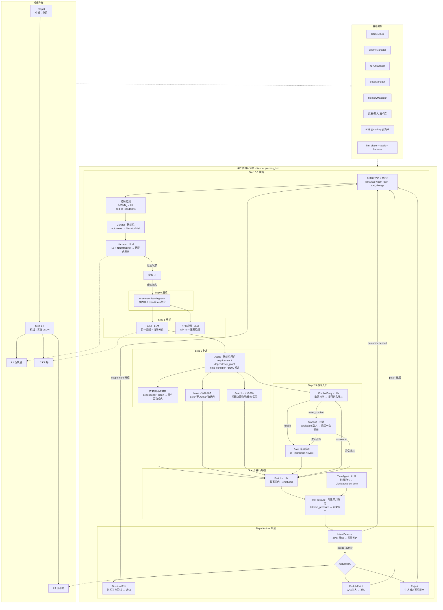

# TRPG 调查员助手

基于 LLM 的 TRPG（桌上角色扮演游戏）KP 助手，COC 7th 规则。从玩家输入到沉浸式叙事生成的完整调用链。

> **编码**：本项目 ~98% 的代码由 Claude Code / Open Code + DeepSeek 自动生成，DeepSeek V4 Pro 贡献 90% 以上代码，Kimi 用于前端审美辅助，Gemini 辅助设计。作者主要负责需求分析、架构设计、提示词微调、方法论管理与测试验证。

## 系统综述

TRPG 调查员助手是一个**模块化、多层 LLM 协作的跑团游戏引擎**——模组创作→游戏运行→测试审计的完整工具链。

**核心思路**：将 TRPG 游戏分解为可独立演进的子系统——战斗、NPC、时间、检定、叙事、模组创作——每个子系统通过 dataclass 消息合约通信，可单独替换或增强。LLM 负责叙事与意图判定，确定性规则负责数值检定与状态管理。



### 关键特性

| 维度 | 说明 |
|------|------|
| 架构 | 4-Agent 协作（Keeper/Narrator/Author/TimeAgent）+ IntentDetector + PreParseDisambiguator，14 个独立子系统 |
| 管线 | 小说→模组→三层 JSON，13 次 LLM 调用，全自动渐进式解析 |
| 战斗 | 独立回合制引擎，群组模型（按 scene+enemy_ref 合并），LLM 双 Agent 修正，交互式 CLI + 自动战斗 |
| NPC | LLM 对话 + 跟随系统 + 前置条件门禁（带事件名自然语言提示） |
| 检定 | COC 7th D100 + trait enhancement + 失败递增惩罚 |
| 时间 | 确定性分钟计时器 + LLM 时间评估 + entity 时间约束 |
| 扩展 | @markup 副效果系统（8 种），Author 运行时动态创作 |
| 前端 | FastAPI + HTMX + Tailwind CSS，视觉小说风格沉浸布局 |
| 数据 | 三层信息架构（玩家/KP/设计者），JSON 全量序列化 |

---

# 玩家版 · 游戏指南

## 安装与启动

```bash
pip install openai httpx python-docx PyPDF2 ipython fastapi uvicorn jinja2 websockets pyinstaller
# 在项目根目录创建 .env: DEEPSEEK_API_KEY=your-key
```

```bash
uvicorn frontend.server:app --reload    # 前端模式 → localhost:8080
python run_game.py                      # CLI 模式
```

## 前端页面

| 路由 | 页面 | 功能 |
|------|------|------|
| `/` | 启动页 | 模组生成管线 / 小说转模组 / 开始游戏 / 全局设置 |
| `/character` | 车卡创建 | 3 步向导：属性掷骰 → 职业+技能 → 预览导出 |
| `/game` | 游戏循环 | 视觉小说风格沉浸布局，双面板（叙事+角色卡） |
| `/editor` | JSON 编辑器 | 三栏布局：文件树 → JSON 树 → 校验状态 |

## 游戏内功能

- **探索**：输入行动描述，系统匹配场景互动物/通行路径
- **检定**：D100 技能检定（COC 7th 45 项标准技能），成功/失败影响叙事
- **战斗**：回合制战斗，群组模型（同类敌人按场景合并），动作：攻击/回避/逃跑/隐蔽/瞄准/蓄力
- **NPC 对话**：与场景内 NPC 自由交谈，前置条件门禁带事件名提示
- **搜索**：检定成功发现隐藏物品/线索/武器
- **存档**：`/save <槽位>` 保存，`/load <槽位>` 读取

## 调试命令

| 命令 | 作用 |
|------|------|
| `/scene` | 查看当前场景完整信息 |
| `/char` | 查看调查员角色卡 |
| `/flags` | 查看已完成实体和运行时状态 |
| `/events` | 查看已触发事件 |
| `/help` | 帮助 |
| `/spawn enemy <名称>` | 从敌人库生成敌人 |
| `/spawn weapon <名称>` | 从武器库分发武器 |
| `/health` | Pipeline 监控快照（LLM 调用统计 + 回合步骤状态） |

---

# KP 版 · 模组配置与运行

## 模组生成管线

### 完整流程

```
纯小说/叙事文本
  │ python run_step0.py <小说路径>              ← Step 0: 小说→模组（1 次 LLM）
  ▼ data/modules/<名称>/module_step0.txt
  │ python run_pipeline.py --auto ...           ← Step 1-4: 模组→三层 JSON（12 次 LLM）
  ▼ data/modules/<名称>/l1/l2/l3.json
  │ 启动游戏
  ▼ 玩家体验
```

### Step 0 — 叙事转模组

```bash
python run_step0.py "我的小说.txt"
python run_step0.py "小说.txt" "data/modules/模组名/out.txt"
```

LLM 两阶段处理：以原作者视角理解剧情 → 以模组设计师身份改写。输出含模块概览/场景/NPC/敌人/线索与物品/事件/结局/地图。

### Step 1-4 — 模组→三层 JSON

```bash
python run_pipeline.py                                      # 交互式向导
python run_pipeline.py --auto --docx "常暗之厢.docx" --module 常暗之厢
python run_pipeline.py --config config.json --start-from step_3a  # 断点续跑
```

12 次 LLM 调用，渐进式解析：结构化提取 → Interactions + 场景移动 → Events/L1/L3 并行 → Boss 遭遇 → 去重验证 → 交叉核对 → 依赖图。

### 标准库素材提取

从小说中自动提取敌人/Boss/武器补充到标准库：

```bash
python scripts/extract_library.py "小说.md"
```

LLM 提取 → 与现有库去重 → 展示新条目 → 手动确认 → 写入 `data/library/core/*.json`。

## @markup 副效果系统（8 种）

| 标记 | 效果 | 路径 |
|------|------|------|
| `@spawn_enemy(enemy_ref="", scene="", quantity=1)` | 生成敌人（同一场景同类自动合并群组） | EnemyManager.spawn() → combat entry |
| `@grant_weapon(weapon_ref="", scene="", quantity=1)` | 武器放置到场景 | SceneWeapon → search → 拾取 |
| `@stat_change(stat_name="", delta=-1)` | 修改属性 | Investigator.modify_stat() |
| `@item_gain(item_name="", quantity=1)` | 获得物品 | ItemManager.add() |
| `@consume_item(item_name="", quantity=1)` | 消耗物品 | ItemManager.remove() |
| `@npc_state_change(npc_name="", new_state="")` | NPC 状态变化 | NPCManager.set_state() |
| `@npc_follow(npc_name="", follow=true/false)` | NPC 跟随/离开 | NPCManager.set_following() |
| `@grant_spell(spell_ref="")` | 获得法术（U9 预留） | Investigator.known_spells |

---

# 开发者版 · 架构与设计

## 设计理念

- **高内聚模块化**：每个子系统（CombatSystem / EnemyManager / NPCManager / Judge / Curator / Clock）是独立可编辑的模块，通过 dataclass 消息合约通信，可脱离主循环单独测试
- **Agent 层封装**：Keeper 是 Agent 集合的编排封装，内部持有 Judge（确定性）、Curator（确定性）、PreParseDisambiguator（消歧网关）、CombatSystem（独立引擎），通过 ThreadPoolExecutor 并行编排 enrich / combat_entry / TimeAgent
- **确定性+LLM 混合**：硬性条件（requirement/dependency/time_condition）确定性判断，叙事/意图判定 LLM 执行

## 三层信息架构

| 层 | 拥有者 | 职责 |
|----|--------|------|
| L1 | Narrator | 场景初始感知信息，面向玩家 |
| L2 | Keeper | 场景/互动/事件/AT/NPC/敌人/Boss 完整数据 |
| L3 | Author | 模组设计意图、叙事线、时间压力、结局条件 |

## 多 Agent 数据流

```
玩家输入 → parse(LLM) → judge(确定) → [enrich(LLM) ∥ combat_entry(LLM) ∥ TimeAgent(LLM)]
  → [对峙(optional)] → curate → narrator(LLM) → 输出
      ↓ other+有意义                     ↓ enter_combat
  Author(LLM)                         CombatSystem
  ├─ Patch → integrate → 递归         ├─ 战斗回合循环
  ├─ StructuralEdit → supplement       └─ 善后 → exit_combat
  └─ Reject → 注入提示
```

| Agent | 职责 |
|-------|------|
| Keeper | Agent 层封装，回合编配（parse → judge → 并行 enrich/combat_entry/TA → 对峙/Boss → curate） |
| Narrator | 唯一面向玩家，L1 + NarratorBrief → 沉浸式叙事 |
| Author | Patch（填缺口）/ StructuralEdit（触发补充管线），WR0 独立可配 |
| TimeAgent | 轻量 LLM 时间评估器，读 Clock 不写 |
| PreParseDisambiguator | Parse 前消歧网关，模糊输入反问引导，跨 turn 上下文整合 |
| IntentDetector | Parse 命中 other 时判断是否有实际叙事意图 |

## 战斗系统 v2

- **群组模型**：敌人按 `(scene, enemy_ref)` 合并为群组，quantity 在进入战斗时展开为独立实体
- **数量展开**：quantity > 1 群组在 `_init_combat` 中拆分为 `_c0`/`_c1`…独立实体，战后整群移除
- **≥5 敌人**：CombatInit 自动截断到 5 个，打赢 = 全部 defeated
- **战后处理**：`exit_combat` outcome 驱动 — win → 全 defeated，非 win → 恢复 hostile
- **Boss 合并**：同一回合 Boss + 普通敌人合并到一个 CombatInit，不覆盖
- **LLM 修正**：`_llm_correct_round`（玩家）+ `_llm_correct_enemy_round`（敌人）双 Agent
- **退出**：`flee` 不清理敌人，通关后 Boss 战斗存在

详见 `docs/combat-system-v2.md`。

## 项目结构

```
run_step0.py                   # Step 0: 小说→模组
run_pipeline.py                # 管线 CLI 入口
run_game.py                    # CLI 游戏入口
scripts/
  extract_library.py           # 标准库素材提取
src/
├── scenario_core.py           # Entity/Node/Edge/DirectedGraph/ScenarioWorld/MemoryManager
├── game_loop.py               # init_game() + run_turn()
├── prompts.py                 # LLM Prompt 构建器
├── llm.py                     # DeepSeek API 封装
├── config.py / config_llm.py  # 集中化配置
├── llm_player.py              # LLM 模拟玩家，自动化跑局测试
├── audit_player_log.py        # 日志审计
├── game/
│   ├── messages.py            # 消息 dataclass
│   ├── side_effects.py        # 8 种 @markup 解析器
│   ├── clock.py               # GameClock
│   ├── judge.py               # 确定性闸门（requirement + D100）
│   ├── curator.py             # outcomes → NarratorBrief
│   ├── combat.py              # CombatSystem v2
│   ├── enemy_manager.py       # 敌人群组管理
│   ├── boss_manager.py        # Boss 发现/触发/构造
│   ├── npc_manager.py         # NPC 对话/跟随/前置条件
│   ├── turn_logger.py         # TurnLogger 回合日志
│   └── agents/                # Keeper / Narrator / Author / TimeAgent
├── library/                   # 武器/敌人/Boss 标准库
├── investigator/              # COC 7th 调查员系统
└── module_designer/           # 三层信息引擎
frontend/
├── server.py                  # FastAPI 统一入口
├── routers/                   # launcher / character / game / editor / files
├── templates/                 # Jinja2 模板
└── static/                    # 捆绑字体 + CSS
data/
└── library/core/              # 标准库 JSON（enemies/bosses/weapons/templates）
```

## 自动化 System

- **自动存档**：定时器 + 回合触发，循环归档 `data/autosave/autosave_1~5.json`
- **Pipeline 监控**：LLMSensor → AgentMonitor（自动降级）→ TurnMonitor（冻结恢复），`/health` 命令查看
- **模拟测试**：`tools/watchdog.ps1` 心跳检测，5 分钟无输出杀进程

## 设计文档索引

- 战斗系统: `docs/combat-system-v2.md`
- 设计文档（架构原理）: `docs/design.md`
- 时间系统: `docs/superpowers/specs/2026-05-19-time-system-design.md`
- Boss/NPC: `docs/superpowers/specs/2026-05-20-boss-npc-design.md`
- 测试体系: `docs/superpowers/specs/2026-05-20-test-suites.md`
- ScenarioWorld: `docs/superpowers/specs/2026-05-22-world-refactor-design.md`
- NPC-Entity 分离: `docs/superpowers/specs/2026-05-25-npc-entity-separation-design.md`
- 前端 v2: `docs/superpowers/specs/2026-05-25-frontend-redesign-design.md`
- 法术体系: `docs/superpowers/specs/2026-05-27-magic-system-design.md`
- Multi-Agent: `docs/superpowers/specs/2026-05-16-game-loop-multi-agent-design.md`
- Packing: `docs/superpowers/specs/2026-05-23-packing-design.md`
- 维护文档（函数级）: `MAINTENANCE.md`
- 模组创作指南: `docs/superpowers/guides/module-authoring-guide.md`
- Journal: `LEARNING_JOURNAL.md` / `DEBUG_JOURNAL.md`

## 待升级

| # | 事项 | 说明 | 优先级 |
|----|------|------|:---:|
| U2 | **世界状态系统** | Logger 驱动的状态解读（需考虑法术系统和其他潜在系统依赖）（✅ 2026-08-14 基础版：WorldChronicle 编年史喂 Author） | 高 |
| U9 | **技能系统重修** | 技术难度低但设计难，COC7 规则技能体系本身抽象，不必照搬（✅ 2026-08-15：20 技能/8 属性配置化 + 归一单点 + LUCK 声明消耗） | 高 |
| U3 | LLM Provider 抽象 | 支持 OpenAI/Anthropic 多 provider（等功能层改完再做） | 中 |
| U4 | 跨模组持久化 | 调查员永久化、战役系统（低难度，依赖技能系统重修） | 中 |
| U6 | 法术体系 | SpellJudge + @grant_spell（低难度，等世界状态系统+技能系统重修再做） | 中 |
| U7 | LLM 调用成本优化 | 各步骤最低配置（低难度，等功能层改完再做） | 中 |
| U8 | 物品系统升级 | 低难度 + 低收益 | 中低 |
| U1 | NPC 系统升级 | 态度、跟随系统更主动化（等另一个项目技术迁移） | 低 |
| U10 | 自动化测试体系 | 已完成基本版，剩余部分等另一个项目技术迁移 | 低 |
| U5 | 多人模式 (Hotseat) | 同机多调查员，完全改变现有体系，系统完善前不考虑 | 极低 |
